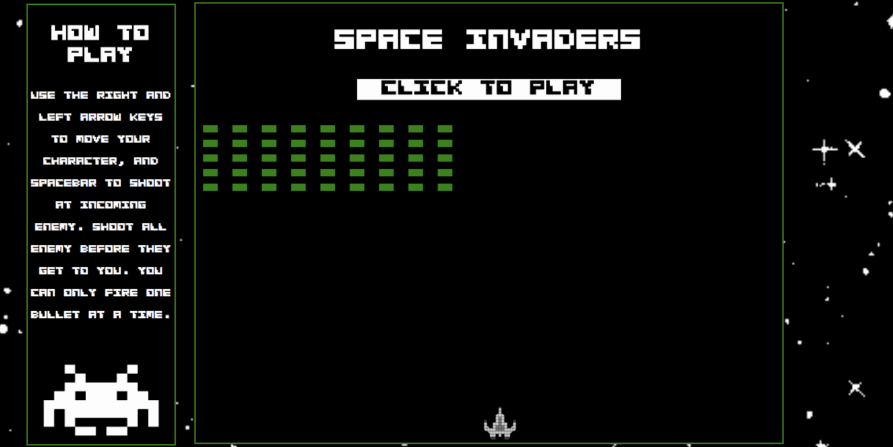

# PROJECT-1-WDI - Space Invaders

# Project Description

We had one week to build an in-browser game using HTML5, CSS3, Javascript & jQuery. I built a version of the retro arcade game Space Invaders.

# Technologies

* HTML5
* SCSS
* Javascript jQuery
* Git
* Github

# Play

(Currently not mobile responsive)

https://racheldolan.github.io/project-1-wdi/

# Game Description

###### The game uses the left and right arrows to move the character along the bottom of the screen within the main box and the spacebar to shoot at incoming alien enemy.

###### When you click the banner the instructions disappear and gameplay begins. As your score increases based on the number of enemy killed, the speed of the grid of aliens increases.

###### If you manage to kill all of the enemy and get the maximum score of 45, you've completed the game and can click the Game Won banner to begin again.

###### If the aliens reach you it's game over.

# The Build

My biggest challenge was getting to grips with intervals. In order to increase the speed of the alien grid, I had to decrease the interval. I initially thought I could override the initial interval I'd created, but instead I was creating new ones which left me unable to clear the original interval, which meant the grid wouldn't stop moving.

If I were to start the project again I would've started by creating the alien grids dynamically using Javascript rather than building them with HTML first. My thinking was to get the movement of the grid working first before coming back and refactoring to make the code more DRY. However, I should have been refactoring as i went along, as generating the grid after perfecting the movement meant recalculating the movement of the grid which was time-consuming.

I'd say my biggest victories were getting collision detection working, and enabling the character to fire bullets from its current position that were not then bound to following the character's path.

---

# Extra Features

* Make the enemy aliens able to shoot back and be able to kill the main character after a certain amount of collisions which slowly reduce its health.

* Include barriers between the character and the aliens so that the main character can hide behind them but they also inhibit its ability to shoot.

* The grid of aliens move quicker as time goes on, and I'd like to stretch this across different levels - not only will the aliens get faster, but they fire bullets more frequently.

* The game isn't mobile responsive, so I'd also like to re-visit it to optimise for different screen sizes.

---
